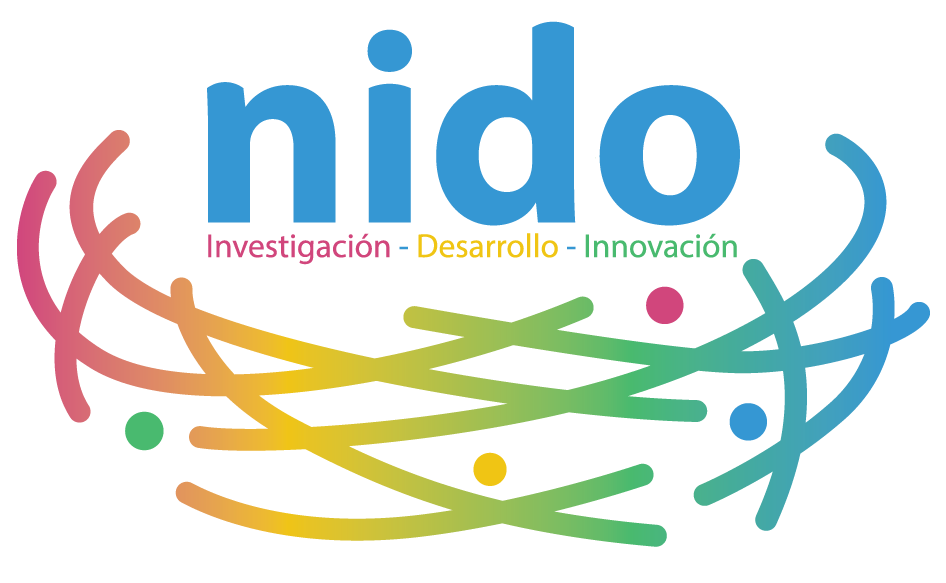
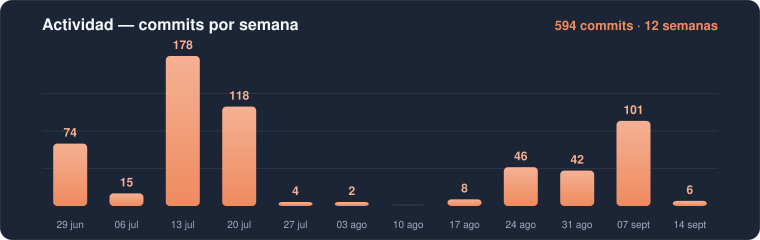
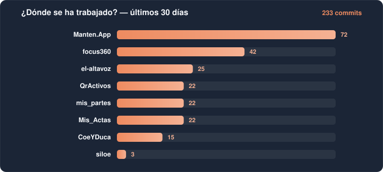

# Nido de Ideas Avanzadas

### *Tecnología para el bien común*

Un ecosistema de aplicaciones que comparten **una sola cuenta, una sola empresa activa y un solo soporte** —
gestión de mantenimiento, partes de trabajo, actas con firma digital, chat de equipo y mucho más.

[🌐 nidodeideas.es](https://nidodeideas.es) · [✉️ info@nidodeideas.es](mailto:info@nidodeideas.es)

---

## 🚀 El ecosistema Nido

| | | |
|---|---|---|
| 🛠️ **[MantenApp](https://panel.manten.app)** Activos, operaciones y finanzas para pymes | 🔧 **[Mis Partes](https://mis-partes.netlify.app)** Partes de trabajo con firma digital | 📝 **[Mis Actas](https://misactas.netlify.app)** Actas de reuniones firmadas y sin papeles |
| 📣 **[El Altavoz](https://elaltavoz.app)** El chat del ecosistema | 🎯 **[focus360°](https://focus360o.app)** El panel de administración | 💼 **[Labora-e](https://labora-e.com)** La plataforma laboral |
| 🔳 **[QR Solutions](https://qractivos.netlify.app)** Códigos QR para activos y espacios | 🎓 **[CoeYDuca](https://coeduca.netlify.app)** App web del ecosistema | 🪺 **[nidodeideas.es](https://nidodeideas.es)** La web corporativa |

## 📈 Actividad

## 📊 Cuadro de mando

<!-- DASHBOARD:START -->
| Proyecto | Descripción | Actividad | Último push | Web | Deploy |
|---|---|:---:|---|:---:|:---:|
| 📝 **[Mis_Actas](https://github.com/NidoIDi/Mis_Actas)** | Actas de reuniones con firma digital, quórum e informe PDF — React + Supabase | 🟢 hoy | 25 ago 2026 | [abrir ↗](https://misactas.netlify.app) |  |
| 🎯 **[focus360](https://github.com/NidoIDi/focus360)** | focus360° — panel de administración del ecosistema Nido | 🟢 ayer | 24 ago 2026 | [abrir ↗](https://focus360o.app) | — |
| 📣 **[el-altavoz](https://github.com/NidoIDi/el-altavoz)** | El Altavoz — el chat del ecosistema Nido: equipos, clientes y soporte | 🟢 ayer | 24 ago 2026 | [abrir ↗](https://elaltavoz.app) | — |
| 🌾 **[siloe](https://github.com/NidoIDi/siloe)** | SILO-E — sitio web | 🟢 ayer | 24 ago 2026 | — | — |
| 🏢 **[mis-espacios](https://github.com/NidoIDi/mis-espacios)** | Mis Espacios | 🟢 ayer | 24 ago 2026 | — | — |
| 🧪 **[MVPPaisVasco](https://github.com/NidoIDi/MVPPaisVasco)** | MVP País Vasco | 🟢 ayer | 24 ago 2026 | — | — |
| 🪺 **[nidodeideas-web](https://github.com/NidoIDi/nidodeideas-web)** | nidodeideas.es — web corporativa de Nido de Ideas Avanzadas | 🟢 ayer | 24 ago 2026 | [abrir ↗](https://nidodeideas.es) | — |
| 🔳 **[QrActivos](https://github.com/NidoIDi/QrActivos)** | QR Solutions — códigos QR para activos y espacios | 🟢 ayer | 24 ago 2026 | [abrir ↗](https://qractivos.netlify.app) | — |
| 🗺️ **[mantenapp-mapa](https://github.com/NidoIDi/mantenapp-mapa)** | Mapa de activos de MantenApp | 🟢 ayer | 24 ago 2026 | — | — |
| 🛠️ **[Manten.App](https://github.com/NidoIDi/Manten.App)** | MantenApp — activos, operaciones, tareas y finanzas para pymes | 🟢 ayer | 24 ago 2026 | [abrir ↗](https://panel.manten.app) | — |
| 🎓 **[CoeYDuca](https://github.com/NidoIDi/CoeYDuca)** | CoeYDuca — app web del ecosistema Nido | 🟢 ayer | 24 ago 2026 | [abrir ↗](https://coeduca.netlify.app) |  |
| 🔧 **[mis_partes](https://github.com/NidoIDi/mis_partes)** | Partes de trabajo con firmas digitales — React + Supabase (web, iOS y Android) | 🟢 ayer | 24 ago 2026 | [abrir ↗](https://mis-partes.netlify.app) |  |
| 🌐 **[andisa-web](https://github.com/NidoIDi/andisa-web)** | Web de Andisa | 🟢 ayer | 24 ago 2026 | — | — |
| 💼 **[labora_e](https://github.com/NidoIDi/labora_e)** | Labora-e — plataforma laboral del ecosistema Nido | 🟢 ayer | 24 ago 2026 | [abrir ↗](https://labora-e.com) | — |

**Leyenda:** 🟢 activo (≤ 2 días) · 🟡 esta semana · 🟠 este mes · ⚪ en reposo

🔄 Actualizado automáticamente cada 6 horas · Última vez: **martes, 25 de agosto de 2026, 14:32** (hora de Madrid)
<!-- DASHBOARD:END -->

---

© Nido de Ideas Avanzadas · Hecho en España 🇪🇸

